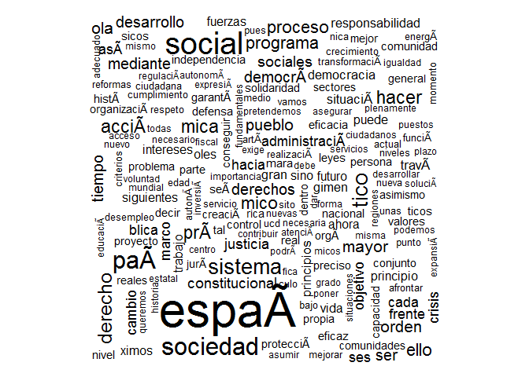
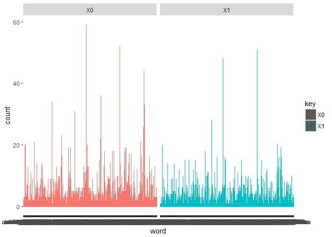

Discursos Presidenciales
================

GitHub Documents
----------------

This is an R Markdown format used for publishing markdown documents to GitHub. When you click the **Knit** button all R code chunks are run and a markdown file (.md) suitable for publishing to GitHub is generated.

Including Code
--------------

You can include R code in the document as follows:

``` r
txt <- readLines("data/00.txt",encoding="UTF-8")
#txt = iconv(txt, to="ASCII//TRANSLIT")
#corpus <- Corpus(VectorSource(txt))
txt00 = readLines("data/00.txt",encoding="UTF-8") %>% tibble()
txt00 = txt00 %>% filter(txt != "")
#txt = iconv(txt, to="ASCII//TRANSLIT")
corpus <- Corpus(VectorSource(txt00))
d  <- tm_map(corpus, tolower)
d  <- tm_map(d, stripWhitespace)
d <- tm_map(d, removePunctuation)
d <- tm_map(d, removeWords, stopwords("spanish"))
tdm <- TermDocumentMatrix(d)

findFreqTerms(tdm, lowfreq=20)
```

    ##  [1] "acciÃ"       "constituciÃ" "derecho"     "econÃ"       "espaÃ"      
    ##  [6] "gobierno"    "hacer"       "ley"         "libertad"    "mica"       
    ## [11] "paÃ"         "polÃ"        "prÃ"         "seguridad"   "sistema"    
    ## [16] "social"      "sociedad"    "tica"        "tico"

Including Plots
---------------

You can also embed plots, for example:

``` r
m <- as.matrix(tdm)
v <- sort(rowSums(m),decreasing=TRUE)
df <- data.frame(word = names(v),freq=v)
```



Note that the `echo = FALSE` parameter was added to the code chunk to prevent printing of the R code that generated the plot.

``` r
library(tidytext)

names(txt00) = c('txt')
tidy_txt00 <- txt00 %>% mutate(cap='00') %>% 
  unnest_tokens(word, txt)

stop_words = as.data.frame(stopwords("spanish"))
names(stop_words) = c("word")
clean_txt00 = tidy_txt00 %>% 
  anti_join(stop_words)
clean_txt00 %>% count(word, sort = TRUE) 
```

    ## # A tibble: 2,668 x 2
    ##            word     n
    ##           <chr> <int>
    ##  1     gobierno    59
    ##  2     política    52
    ##  3       social    44
    ##  4     libertad    36
    ##  5 constitución    34
    ##  6     sociedad    33
    ##  7       españa    31
    ##  8      sistema    26
    ##  9      derecho    23
    ## 10          ley    22
    ## # ... with 2,658 more rows

``` r
library(plyr)
paths <- dir(".", pattern = "\\.txt$", full.names = TRUE)
lineas = ldply(paths, read.csv, stringsAsFactors = FALSE, header=T, sep="\t", encoding = 'UTF-8') %>% gather(na.rm = TRUE)
palabras = lineas %>% unnest_tokens(word,value) %>% anti_join(stop_words)
palabras %>% ggplot(aes(word, color=key)) + geom_bar(stat="count", aes(color=key)) + facet_grid(.~key)
```



``` r
sessionInfo()
```

    ## R version 3.4.1 (2017-06-30)
    ## Platform: x86_64-w64-mingw32/x64 (64-bit)
    ## Running under: Windows 10 x64 (build 14393)
    ## 
    ## Matrix products: default
    ## 
    ## locale:
    ## [1] LC_COLLATE=Spanish_Spain.1252  LC_CTYPE=Spanish_Spain.1252   
    ## [3] LC_MONETARY=Spanish_Spain.1252 LC_NUMERIC=C                  
    ## [5] LC_TIME=Spanish_Spain.1252    
    ## 
    ## attached base packages:
    ## [1] stats     graphics  grDevices utils     datasets  methods   base     
    ## 
    ## other attached packages:
    ##  [1] plyr_1.8.4         tidytext_0.1.3     bindrcpp_0.2      
    ##  [4] dplyr_0.7.2        purrr_0.2.3        readr_1.1.1       
    ##  [7] tidyr_0.7.0        tibble_1.3.4       ggplot2_2.2.1     
    ## [10] tidyverse_1.1.1    wordcloud_2.5      RColorBrewer_1.1-2
    ## [13] tm_0.7-1           NLP_0.1-11        
    ## 
    ## loaded via a namespace (and not attached):
    ##  [1] slam_0.1-40       reshape2_1.4.2    haven_1.1.0      
    ##  [4] lattice_0.20-35   colorspace_1.3-2  SnowballC_0.5.1  
    ##  [7] htmltools_0.3.6   yaml_2.1.14       rlang_0.1.2      
    ## [10] foreign_0.8-69    glue_1.1.1        modelr_0.1.1     
    ## [13] readxl_1.0.0      bindr_0.1         stringr_1.2.0    
    ## [16] munsell_0.4.3     gtable_0.2.0      cellranger_1.1.0 
    ## [19] rvest_0.3.2       psych_1.7.5       evaluate_0.10.1  
    ## [22] labeling_0.3      knitr_1.17        forcats_0.2.0    
    ## [25] parallel_3.4.1    tokenizers_0.1.4  broom_0.4.2      
    ## [28] Rcpp_0.12.12      backports_1.1.0   scales_0.5.0     
    ## [31] jsonlite_1.5      mnormt_1.5-5      hms_0.3          
    ## [34] digest_0.6.12     stringi_1.1.5     grid_3.4.1       
    ## [37] rprojroot_1.2     tools_3.4.1       magrittr_1.5     
    ## [40] lazyeval_0.2.0    janeaustenr_0.1.5 pkgconfig_2.0.1  
    ## [43] Matrix_1.2-10     xml2_1.1.1        lubridate_1.6.0  
    ## [46] assertthat_0.2.0  rmarkdown_1.6     httr_1.3.1       
    ## [49] R6_2.2.2          nlme_3.1-131      compiler_3.4.1
