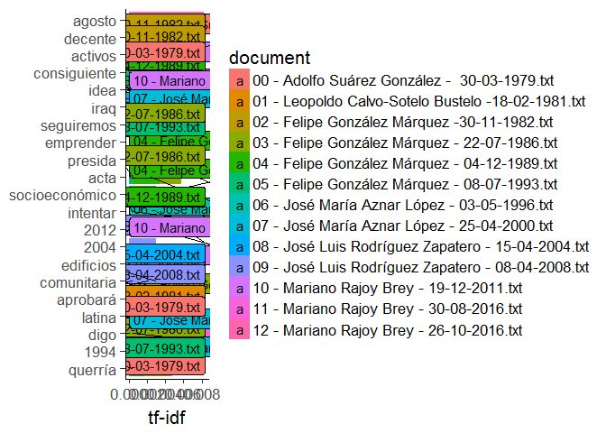
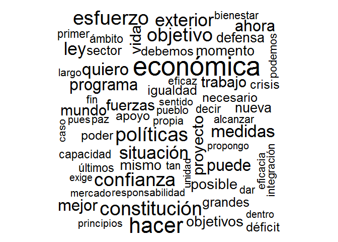

Discursos Presidenciales
================

GitHub Documents
----------------

This is an R Markdown format used for publishing markdown documents to GitHub. When you click the **Knit** button all R code chunks are run and a markdown file (.md) suitable for publishing to GitHub is generated.

Including Code
--------------

You can include R code in the document as follows:

``` r
folderdir="data/"
speeches_raw = VCorpus(DirSource(folderdir, encoding = "UTF-8"), readerControl=list(reader=readPlain,language="es"))
#speeches<-Corpus(DirSource("data/"))
add.stops=c("vez", "sino", "cada", "ello", "así", "sólo", "que", "que,", "señorías", "señorías,","gobierno","política","españa","españoles","país","ser","hacia","años","debe","cualquier","año","manera","todas","mayor","parte","presidenta","ustedes","vista","señora")
speeches = speeches_raw
speeches = tm_map (speeches, content_transformer(tolower))
speeches = tm_map (speeches, removePunctuation)
speeches = tm_map (speeches, stripWhitespace)
speeches = tm_map (speeches, removeWords, stopwords("spanish"))
speeches = tm_map (speeches, removeWords, add.stops)
#speeches = tm_map (speeches, stemDocument, language="spanish")

my_scanner <- function(x) strsplit(x," ")
my_tokenizer <- function (x) 
{
  strsplit(iconv(x, to='UTF-8'), split='([[:space:]]|[[:punct:]])+', perl=F)[[1]]
}
speech.control=list(stopwords=c(stopwords("spanish"),add.stops), removeNumbers=FALSE, removePunctuation=FALSE) #, tokenize=my_tokenizer
speeches.dtm<-TermDocumentMatrix(speeches, control=speech.control)
notSparse = removeSparseTerms(speeches.dtm, 0.99)
tidy_speeches = tidy(speeches.dtm) %>% bind_tf_idf(term, document, count)

tidy_notSparse = tidy(notSparse)
speeches.matrix <- as.matrix(speeches.dtm)
findFreqTerms(speeches.dtm, lowfreq=100)
```

    ##  [1] "acción"         "acuerdo"        "administración" "ahora"         
    ##  [5] "cámara"         "ciudadanos"     "comunidades"    "confianza"     
    ##  [9] "constitución"   "cooperación"    "crecimiento"    "desarrollo"    
    ## [13] "economía"       "económica"      "empleo"         "esfuerzo"      
    ## [17] "española"       "europea"        "exterior"       "futuro"        
    ## [21] "hacer"          "hoy"            "legislatura"    "ley"           
    ## [25] "medidas"        "objetivo"       "países"         "políticas"     
    ## [29] "problemas"      "proceso"        "programa"       "público"       
    ## [33] "puede"          "quiero"         "reforma"        "seguridad"     
    ## [37] "sistema"        "situación"      "social"         "sociales"      
    ## [41] "sociedad"       "tiempo"

``` r
tidy_speeches %>% group_by(document) %>% top_n(10) %>% ungroup() %>% ggplot(aes(term,count)) + geom_bar(stat="identity", aes(colour=document, alpha=1/2)) + facet_wrap(~document, scales = "free", ncol = 1) + theme(legend.position="none")
```


``` r
tidy_speeches = tidy(speeches.dtm) %>% bind_tf_idf(term, document, count)

plot_speeches <- tidy_speeches %>%
   arrange(desc(tf_idf)) %>%
   mutate(word = factor(term, levels = rev(unique(term)))) 
#%>%  mutate(id = str_extract(document, "^.."))

plot_speeches %>% 
   top_n(50) %>%
   ggplot(aes(word, tf_idf, fill = document)) +
   geom_col() +
   geom_label_repel(aes(label=document)) +
   labs(x = NULL, y = "tf-idf") +
   coord_flip() +
  theme_classic(base_size = 16)
```



``` r
m <- as.matrix(speeches.dtm)
v <- sort(rowSums(m),decreasing=TRUE)
df <- data.frame(word = names(v),freq=v)
```



``` r
distancias <- as.matrix(dist(speeches.matrix, 
                             method = "binary", 
                             diag = TRUE, 
                             upper = FALSE, 
                             p = 2))
```

``` r
txt <- readLines("./00.txt",encoding="UTF-8")
#txt = iconv(txt, to="ASCII//TRANSLIT")
#corpus <- Corpus(VectorSource(txt))
txt00 = readLines("00.txt",encoding="UTF-8") %>% tibble()
txt00 = txt00 %>% filter(txt != "")
#txt = iconv(txt, to="ASCII//TRANSLIT")
corpus <- Corpus(VectorSource(txt00))
d  <- tm_map(corpus, tolower)
d  <- tm_map(d, stripWhitespace)
d <- tm_map(d, removePunctuation)
d <- tm_map(d, removeWords, stopwords("spanish"))
scanner <- function(x) strsplit(x," ")
tdm <- TermDocumentMatrix(d,control=list(tokenize=scanner))

findFreqTerms(tdm, lowfreq=20)
```

    ##  [1] "acciÃ"       "constituciÃ" "derecho"     "econÃ"       "espaÃ"      
    ##  [6] "gobierno"    "hacer"       "ley"         "libertad"    "mica"       
    ## [11] "paÃ"         "polÃ"        "prÃ"         "seguridad"   "sistema"    
    ## [16] "social"      "sociedad"    "tica"        "tico"

Including Plots
---------------

You can also embed plots, for example:

``` r
m <- as.matrix(tdm)
v <- sort(rowSums(m),decreasing=TRUE)
df <- data.frame(word = names(v),freq=v)
```


Note that the `echo = FALSE` parameter was added to the code chunk to prevent printing of the R code that generated the plot.

``` r
names(txt00) = c('txt')
tidy_txt00 <- txt00 %>% mutate(cap='00') %>% 
  unnest_tokens(word, txt)

stop_words = as.data.frame(stopwords("spanish"))
names(stop_words) = c("word")
clean_txt00 = tidy_txt00 %>% 
  anti_join(stop_words)
clean_txt00 %>% count(word, sort = TRUE) 
```

    ## # A tibble: 2,669 x 2
    ##            word     n
    ##           <chr> <int>
    ##  1     gobierno    59
    ##  2     política    52
    ##  3       social    44
    ##  4     libertad    36
    ##  5 constitución    34
    ##  6     sociedad    33
    ##  7       españa    31
    ##  8      sistema    26
    ##  9      derecho    23
    ## 10          ley    22
    ## # ... with 2,659 more rows

``` r
sessionInfo()
```

    ## R version 3.4.1 (2017-06-30)
    ## Platform: x86_64-w64-mingw32/x64 (64-bit)
    ## Running under: Windows 10 x64 (build 14393)
    ## 
    ## Matrix products: default
    ## 
    ## locale:
    ## [1] LC_COLLATE=Spanish_Spain.1252  LC_CTYPE=Spanish_Spain.1252   
    ## [3] LC_MONETARY=Spanish_Spain.1252 LC_NUMERIC=C                  
    ## [5] LC_TIME=Spanish_Spain.1252    
    ## 
    ## attached base packages:
    ## [1] stats     graphics  grDevices utils     datasets  methods   base     
    ## 
    ## other attached packages:
    ##  [1] bindrcpp_0.2       stringr_1.2.0      ggrepel_0.6.5     
    ##  [4] SnowballC_0.5.1    tidytext_0.1.3     dplyr_0.7.2       
    ##  [7] purrr_0.2.3        readr_1.1.1        tidyr_0.7.0       
    ## [10] tibble_1.3.4       ggplot2_2.2.1      tidyverse_1.1.1   
    ## [13] plyr_1.8.4         wordcloud_2.5      RColorBrewer_1.1-2
    ## [16] tm_0.7-1           NLP_0.1-11        
    ## 
    ## loaded via a namespace (and not attached):
    ##  [1] slam_0.1-40       reshape2_1.4.2    haven_1.1.0      
    ##  [4] lattice_0.20-35   colorspace_1.3-2  htmltools_0.3.6  
    ##  [7] yaml_2.1.14       rlang_0.1.2       foreign_0.8-69   
    ## [10] glue_1.1.1        modelr_0.1.1      readxl_1.0.0     
    ## [13] bindr_0.1         munsell_0.4.3     gtable_0.2.0     
    ## [16] cellranger_1.1.0  rvest_0.3.2       psych_1.7.5      
    ## [19] evaluate_0.10.1   labeling_0.3      knitr_1.17       
    ## [22] forcats_0.2.0     parallel_3.4.1    tokenizers_0.1.4 
    ## [25] broom_0.4.2       Rcpp_0.12.12      backports_1.1.0  
    ## [28] scales_0.5.0      jsonlite_1.5      mnormt_1.5-5     
    ## [31] hms_0.3           digest_0.6.12     stringi_1.1.5    
    ## [34] grid_3.4.1        rprojroot_1.2     tools_3.4.1      
    ## [37] magrittr_1.5      lazyeval_0.2.0    janeaustenr_0.1.5
    ## [40] pkgconfig_2.0.1   Matrix_1.2-10     xml2_1.1.1       
    ## [43] lubridate_1.6.0   assertthat_0.2.0  rmarkdown_1.6    
    ## [46] httr_1.3.1        R6_2.2.2          nlme_3.1-131     
    ## [49] compiler_3.4.1
