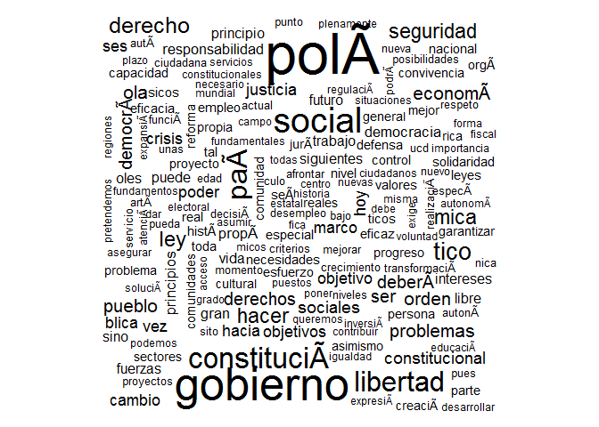

Discursos Presidenciales
================

GitHub Documents
----------------

This is an R Markdown format used for publishing markdown documents to GitHub. When you click the **Knit** button all R code chunks are run and a markdown file (.md) suitable for publishing to GitHub is generated.

Including Code
--------------

You can include R code in the document as follows:

``` r
library(tm)
```

    ## Loading required package: NLP

``` r
library(wordcloud)
```

    ## Loading required package: RColorBrewer

``` r
txt <- readLines("data/00.txt",encoding="UTF-8")
txt = iconv(txt, to="ASCII//TRANSLIT")
corpus <- Corpus(VectorSource(txt))
d  <- tm_map(corpus, tolower)
d  <- tm_map(d, stripWhitespace)
#d <- tm_map(d, removePunctuation)
d <- tm_map(d, removeWords, stopwords("spanish"))
tdm <- TermDocumentMatrix(d)

findFreqTerms(tdm, lowfreq=20)
```

    ##  [1] "accia3n"       "constitucia3n" "gobierno"      "programa"     
    ##  [5] "paa"           "pola"          "sociedad"      "tico"         
    ##  [9] "social"        "tambiacn"      "tica"          "espaa"        
    ## [13] "sistema"       "libertad"      "hacer"         "derecho"      
    ## [17] "seguridad"     "ley"

Including Plots
---------------

You can also embed plots, for example:

``` r
m <- as.matrix(tdm)
v <- sort(rowSums(m),decreasing=TRUE)
df <- data.frame(word = names(v),freq=v)
```



Note that the `echo = FALSE` parameter was added to the code chunk to prevent printing of the R code that generated the plot.
